# Internship Management System - Complete Documentation

> **Note:** This document contains Mermaid diagrams that render in GitHub, GitLab, and most modern markdown viewers. If diagrams don't render in your viewer, consider using a Mermaid-compatible markdown viewer or the [Mermaid Live Editor](https://mermaid.live/).

## Table of Contents

1. [Introduction](#introduction)
2. [System Architecture](#system-architecture)
3. [Entity Relationship Diagram](#entity-relationship-diagram)
4. [Data Models](#data-models)
5. [User Workflows](#user-workflows)
   - [Student Journey](#student-journey)
   - [Company Journey](#company-journey)
   - [Mentor Journey](#mentor-journey)
   - [Admin Journey](#admin-journey)
6. [State Transition Diagrams](#state-transition-diagrams)
   - [Internship Status Flow](#internship-status-flow)
   - [Application Status Flow](#application-status-flow)
   - [Credit Request Status Flow](#credit-request-status-flow)
   - [Company Verification Flow](#company-verification-flow)
7. [API Endpoint Reference](#api-endpoint-reference)
   - [Student Endpoints](#student-endpoints)
   - [Company Endpoints](#company-endpoints)
   - [Mentor Endpoints](#mentor-endpoints)
   - [Admin Endpoints](#admin-endpoints)
8. [Quick Reference](#quick-reference)
   - [Entity Quick Reference](#entity-quick-reference)
   - [Status Values](#status-values)
   - [Role Permissions Matrix](#role-permissions-matrix)

---

## Introduction

This document provides comprehensive visual documentation of the Internship Management System. It includes entity relationships, user workflows, API endpoints, state transitions, and quick reference guides for developers, stakeholders, and new team members.

The system manages the complete lifecycle of internships from company registration and verification through student applications, internship completion, and credit transfer approval.

**Document Purpose:**
- Provide visual reference for system architecture and data relationships
- Document all user workflows and their corresponding API endpoints
- Serve as onboarding material for new developers
- Act as a reference for stakeholders understanding system capabilities
- Support maintenance and future development efforts

### Glossary

**Key Terms:**
- **Entity:** A data model representing a core concept in the system (Student, Company, Internship, etc.)
- **Workflow:** A sequence of steps that accomplish a specific business process
- **API Endpoint:** A specific URL path that handles HTTP requests for system operations
- **Status Transition:** A change from one status value to another in an entity's lifecycle
- **Role:** A classification of system users (Student, Company, Mentor, Admin)
- **Cardinality:** The numerical relationship between entities (1:1, 1:N, N:M)
- **Foreign Key (FK):** A field that references another entity's primary key
- **Primary Key (PK):** A unique identifier field for an entity
- **Unique Key (UK):** A field that must be unique across all records

### System Overview

The Internship Management System is a three-tier application:
- **Frontend**: Next.js React application with role-based dashboards
- **Backend**: Node.js/Express REST API with business logic
- **Data Layer**: MongoDB database with Redis caching

### Key Features

- Multi-role support (Student, Company, Mentor, Admin)
- AI-powered company verification and application ranking
- Multi-stage approval workflows
- Credit transfer management
- Real-time notifications
- Document management and storage
- Analytics and reporting

---

## System Architecture

### High-Level Architecture Diagram

This diagram shows the complete system architecture with all layers, components, and their interactions. Data flows from the frontend through the backend to the data layer, with external services integrated at the backend level.

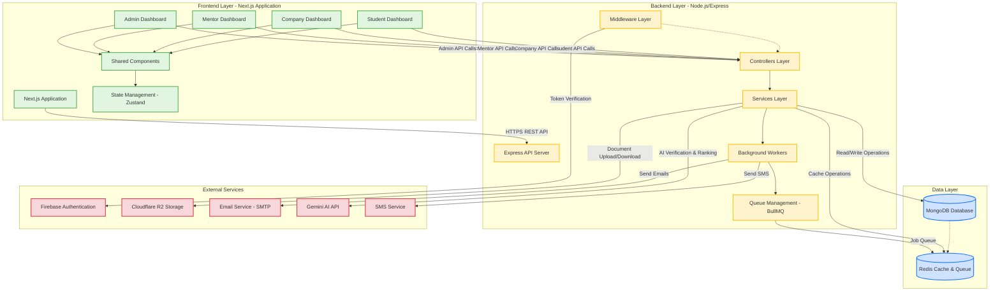

### Detailed Component Interactions

This sequence diagram illustrates how different system components interact during a typical operation. The example shows a student submitting an application, demonstrating the flow through middleware, controllers, services, database, cache, external services, and background workers.

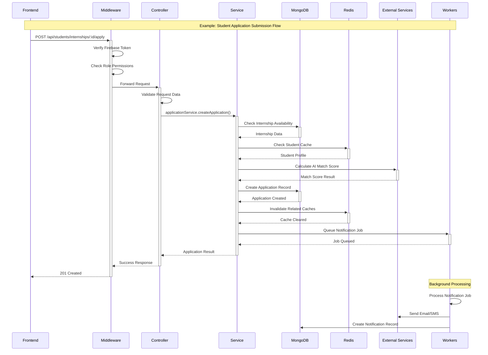

### Architecture Components

#### Frontend Layer (Next.js Application)

**Purpose:** Provides user interfaces for all system roles with responsive design and real-time updates.

**Key Components:**
- **Role-Based Dashboards:** Separate dashboard implementations for Student, Company, Mentor, and Admin roles
- **Shared Components:** Reusable UI components (forms, tables, modals, charts) used across all dashboards
- **State Management:** Zustand for global state management (user session, notifications, cache)
- **API Client:** Axios-based HTTP client with interceptors for authentication and error handling
- **Real-Time Updates:** WebSocket connections for live notifications and status updates
- **Document Management:** File upload components with progress tracking and validation

**Technology Stack:**
- Next.js 14 (App Router)
- React 18
- TypeScript
- Tailwind CSS
- Zustand (State Management)
- Axios (HTTP Client)

**Data Flow:**
1. User interacts with dashboard components
2. Components dispatch actions to state management
3. API client makes authenticated HTTP requests to backend
4. Responses update local state and trigger UI re-renders
5. Real-time updates received via WebSocket connections

---

#### Backend Layer (Node.js/Express)

**Purpose:** Handles business logic, data processing, authentication, and orchestrates interactions between frontend, database, and external services.

**Key Components:**

**1. Controllers Layer:**
- Route handlers that receive HTTP requests
- Request validation and sanitization
- Response formatting and error handling
- Delegates business logic to service layer
- Examples: `studentController.js`, `companyController.js`, `adminController.js`

**2. Services Layer:**
- Core business logic implementation
- Data transformation and validation
- Orchestrates database operations
- Integrates with external services
- Examples: `applicationService.js`, `creditService.js`, `internshipService.js`

**3. Middleware Layer:**
- **Authentication Middleware:** Verifies Firebase tokens and extracts user identity
- **Authorization Middleware:** Checks role-based permissions for routes
- **Validation Middleware:** Validates request payloads against schemas
- **Rate Limiting:** Prevents abuse with request rate limits
- **Error Handling:** Centralized error handling and logging
- **Query Performance:** Monitors and logs slow database queries

**4. Background Workers:**
- **Email Worker:** Processes email notification jobs
- **SMS Worker:** Sends SMS notifications for critical events
- **Analytics Worker:** Generates periodic analytics snapshots
- **Credit Notification Worker:** Sends reminders for pending credit requests
- **Deadline Reminder Worker:** Notifies users of approaching deadlines
- **AI Tagging Worker:** Processes AI-based tagging for internships
- **Logbook Worker:** Processes and validates logbook entries
- **Report Worker:** Generates PDF reports and certificates

**5. Queue Management (BullMQ):**
- Job queue for asynchronous task processing
- Retry logic for failed jobs
- Job prioritization and scheduling
- Progress tracking and monitoring

**Technology Stack:**
- Node.js 18+
- Express.js
- TypeScript/JavaScript
- BullMQ (Job Queue)
- Firebase Admin SDK
- Mongoose (MongoDB ODM)

**Data Flow:**
1. Request arrives at Express server
2. Middleware chain processes request (auth, validation, rate limiting)
3. Controller receives validated request
4. Controller delegates to appropriate service
5. Service performs business logic and database operations
6. Service may queue background jobs for async processing
7. Service returns result to controller
8. Controller formats response and sends to client
9. Background workers process queued jobs independently

---

#### Data Layer

**Purpose:** Provides persistent storage and caching for application data.

**Components:**

**1. MongoDB Database:**
- **Primary Data Store:** All persistent application data
- **Collections:** Students, Companies, Mentors, Admins, Internships, Applications, CreditRequests, InternshipCompletions, Notifications, AiUsageLogs, AnalyticsSnapshots
- **Indexes:** Optimized indexes on frequently queried fields (status, dates, foreign keys)
- **Aggregation Pipelines:** Complex queries for analytics and reporting
- **Transactions:** ACID transactions for critical operations (credit transfers, status updates)

**2. Redis Cache & Queue:**
- **Caching:** Frequently accessed data (user profiles, internship listings, application counts)
- **Session Storage:** User session data and temporary tokens
- **Job Queue:** BullMQ job queue for background processing
- **Rate Limiting:** Request rate limit counters
- **Real-Time Data:** Temporary storage for real-time features

**Technology Stack:**
- MongoDB 6.0+
- Redis 7.0+
- Mongoose (ODM)
- Redis Client

**Data Flow:**
1. Service layer checks Redis cache for requested data
2. If cache hit, return cached data immediately
3. If cache miss, query MongoDB
4. Store result in Redis cache with TTL
5. Return data to service layer
6. Background workers update cache when data changes
7. Job queue stores pending background tasks in Redis

---

#### External Services Integration

**Purpose:** Extends system capabilities with specialized third-party services.

**Services:**

**1. Firebase Authentication:**
- **User Management:** Create, update, delete user accounts
- **Token Verification:** Verify JWT tokens on every API request
- **Password Management:** Handle password resets and email verification
- **Multi-Factor Authentication:** Optional 2FA for admin accounts
- **Integration Point:** Middleware layer verifies tokens before processing requests

**2. Cloudflare R2 Storage:**
- **Document Storage:** Company verification documents, student resumes, certificates
- **Public Access:** Configured for public read access on approved documents
- **Presigned URLs:** Temporary URLs for secure document access
- **Integration Point:** Service layer uploads/downloads documents via R2 SDK

**3. Email Service (SMTP):**
- **Transactional Emails:** Application updates, credit approvals, verification results
- **Notification Emails:** Daily digests, reminders, system announcements
- **Templates:** HTML email templates for consistent branding
- **Integration Point:** Email worker processes email jobs from queue

**4. Gemini AI API:**
- **Company Verification:** Analyzes company documents for legitimacy
- **Application Ranking:** Calculates match scores between students and internships
- **Skill Gap Analysis:** Identifies skill gaps and recommends learning modules
- **Interview Practice:** Powers AI interview bot for student practice
- **Integration Point:** Service layer makes API calls for AI operations

**5. SMS Service:**
- **Critical Notifications:** High-priority alerts sent via SMS
- **Two-Factor Authentication:** SMS-based 2FA codes
- **Integration Point:** SMS worker processes SMS jobs from queue

**Technology Stack:**
- Firebase Admin SDK
- AWS SDK (for R2 compatible API)
- Nodemailer (SMTP)
- Google Generative AI SDK
- Twilio/SMS Gateway API

**Data Flow:**
1. Service layer identifies need for external service
2. For synchronous operations (AI, auth), service calls external API directly
3. For asynchronous operations (email, SMS), service queues background job
4. Background worker processes job and calls external service
5. Results stored in database and cache as needed
6. User notified of completion via notification system

---

### Architecture Patterns

**1. Three-Tier Architecture:**
- Clear separation between presentation (frontend), business logic (backend), and data (database)
- Each tier can be scaled independently
- Changes in one tier have minimal impact on others

**2. Service-Oriented Architecture:**
- Business logic organized into focused services
- Each service handles a specific domain (applications, credits, internships)
- Services can be extracted into microservices if needed

**3. Queue-Based Processing:**
- Long-running tasks processed asynchronously
- Improves API response times
- Provides retry logic and fault tolerance

**4. Caching Strategy:**
- Cache-aside pattern for frequently accessed data
- Cache invalidation on data updates
- TTL-based expiration for stale data prevention

**5. Role-Based Access Control (RBAC):**
- Permissions checked at middleware level
- Fine-grained access control per endpoint
- Role hierarchy (Student < Company < Mentor < Admin < Super Admin)

---

### Scalability Considerations

**Horizontal Scaling:**
- Frontend: Deploy multiple Next.js instances behind load balancer
- Backend: Deploy multiple Express instances with shared Redis/MongoDB
- Workers: Scale worker processes independently based on queue depth

**Vertical Scaling:**
- Database: Increase MongoDB instance size for larger datasets
- Cache: Increase Redis memory for larger cache

**Performance Optimizations:**
- Database indexes on frequently queried fields
- Redis caching for hot data
- Pagination for large result sets
- Lazy loading for frontend components
- CDN for static assets

**Monitoring & Observability:**
- Application logs stored and analyzed
- Performance metrics tracked (response times, error rates)
- Queue depth monitoring for worker scaling
- Database query performance monitoring

---

## Entity Relationship Diagram

### Complete ERD

This diagram shows all core entities in the Internship Management System, their relationships, and key attributes. The system uses MongoDB, so primary keys are ObjectId types, and relationships are implemented through foreign key references.

```mermaid
erDiagram
    Student ||--o{ Application : "applies to"
    Student ||--o{ CreditRequest : "submits"
    Student ||--o{ InternshipCompletion : "completes"
    Student }o--|| Mentor : "assigned to"
    Student ||--o{ Notification : "receives"
    
    Company ||--o{ Internship : "posts"
    Company ||--o{ Application : "receives"
    Company ||--o{ Notification : "receives"
    
    Internship ||--o{ Application : "has"
    Internship ||--o{ InternshipCompletion : "results in"
    
    Application ||--|| InternshipCompletion : "leads to"
    
    InternshipCompletion ||--|| CreditRequest : "generates"
    
    Mentor ||--o{ Application : "reviews"
    Mentor ||--o{ CreditRequest : "reviews"
    Mentor ||--o{ Notification : "receives"
    
    Admin ||--o{ Company : "verifies"
    Admin ||--o{ Internship : "approves"
    Admin ||--o{ CreditRequest : "approves"
    Admin ||--o{ Notification : "receives"
    
    Student {
        ObjectId _id PK
        string studentId UK "Unique student identifier"
        string firebaseUid UK "Firebase auth ID"
        string email UK "Student email"
        object profile "Personal info and skills"
        number readinessScore "AI-calculated readiness 0-100"
        array completedModules "Training modules completed"
        object credits "Earned and pending credits"
        array appliedInternships FK "Internship IDs applied to"
        number completedInternships "Count of completions"
        string status "active, inactive, suspended"
        date createdAt "Account creation date"
        date updatedAt "Last update timestamp"
    }
    
    Company {
        ObjectId _id PK
        string companyId UK "Unique company identifier"
        string firebaseUid UK "Firebase auth ID"
        string companyName "Official company name"
        string email "Company contact email"
        object documents "Verification documents"
        object pointOfContact "Contact person details"
        string status "Verification status"
        object aiVerification "AI verification results"
        object adminReview "Admin review details"
        object reappeal "Reappeal submission data"
        object stats "Performance metrics"
        date createdAt "Registration date"
        date updatedAt "Last update timestamp"
    }
    
    Mentor {
        ObjectId _id PK
        string mentorId UK "Unique mentor identifier"
        string firebaseUid UK "Firebase auth ID"
        string email UK "Mentor email"
        object profile "Name, department, expertise"
        array assignedStudents FK "Student IDs assigned"
        object workload "Current and max capacity"
        string status "active, inactive, on_leave"
        date createdAt "Account creation date"
        date updatedAt "Last update timestamp"
    }
    
    Admin {
        ObjectId _id PK
        string adminId UK "Unique admin identifier"
        string firebaseUid UK "Firebase auth ID"
        string email UK "Admin email"
        string name "Admin full name"
        string role "super_admin, admin, support"
        array permissions "Permission strings"
        string status "active, inactive"
        date createdAt "Account creation date"
        date updatedAt "Last update timestamp"
    }
    
    Internship {
        ObjectId _id PK
        string internshipId UK "Unique internship identifier"
        ObjectId companyId FK "Reference to company"
        string title "Internship title"
        string description "Detailed description"
        string department "Target department"
        array requiredSkills "Required skills array"
        date startDate "Internship start date"
        date applicationDeadline "Application deadline"
        number slots "Total available positions"
        number slotsRemaining "Remaining positions"
        string status "Workflow status"
        object adminReview "Admin review details"
        object mentorApproval "Mentor approval details"
        array departmentApprovals "Department approvals"
        object aiTags "AI-generated tags"
        boolean isDeleted "Soft delete flag"
        date createdAt "Creation timestamp"
        date updatedAt "Last update timestamp"
    }
    
    Application {
        ObjectId _id PK
        string applicationId UK "Unique application identifier"
        ObjectId studentId FK "Reference to student"
        ObjectId internshipId FK "Reference to internship"
        ObjectId companyId FK "Reference to company"
        string department "Application department"
        string status "Workflow status"
        date appliedAt "Application submission time"
        string coverLetter "Student cover letter"
        object mentorApproval "Mentor review details"
        object companyFeedback "Company feedback"
        object aiRanking "AI match score"
        array timeline "Status change events"
        date createdAt "Creation timestamp"
        date updatedAt "Last update timestamp"
    }
    
    InternshipCompletion {
        ObjectId _id PK
        string completionId UK "Unique completion identifier"
        ObjectId studentId FK "Reference to student"
        ObjectId internshipId FK "Reference to internship"
        ObjectId companyId FK "Reference to company"
        number totalHours "Total hours worked"
        number creditsEarned "Credits to be awarded"
        date completionDate "Completion timestamp"
        object evaluation "Company evaluation"
        object certificates "Completion certificates"
        string status "pending, completed, verified"
        object creditRequest "Link to credit request"
        object companyCompletion "Company confirmation"
        date createdAt "Creation timestamp"
        date updatedAt "Last update timestamp"
    }
    
    CreditRequest {
        ObjectId _id PK
        string creditRequestId UK "Unique credit request identifier"
        ObjectId studentId FK "Reference to student"
        ObjectId internshipCompletionId FK "Reference to completion"
        ObjectId internshipId FK "Reference to internship"
        ObjectId mentorId FK "Assigned mentor"
        number requestedCredits "Credits requested"
        number calculatedCredits "System-calculated credits"
        string status "Workflow status"
        object mentorReview "Mentor review details"
        object adminReview "Admin review details"
        array submissionHistory "Submission attempts"
        object certificate "Generated certificate"
        date requestedAt "Request submission time"
        date createdAt "Creation timestamp"
        date updatedAt "Last update timestamp"
    }
    
    Notification {
        ObjectId _id PK
        string notificationId UK "Unique notification identifier"
        ObjectId userId FK "Reference to user any role"
        string role "student, mentor, admin, company"
        string type "Notification type"
        string title "Notification title"
        string message "Notification message"
        string priority "low, medium, high, critical"
        string actionUrl "Optional action URL"
        boolean read "Read status flag"
        date readAt "Read timestamp"
        array deliveries "Multi-channel delivery status"
        object metadata "Additional metadata"
        date createdAt "Creation timestamp"
        date updatedAt "Last update timestamp"
    }
```

### Relationship Descriptions

This section describes the cardinality and nature of relationships between entities in the system.

**Student Relationships:**
- One student can have many applications (1:N) - Students apply to multiple internships
- One student can have many credit requests (1:N) - Students submit multiple credit requests over time
- One student can have many internship completions (1:N) - Students complete multiple internships
- Many students are assigned to one mentor (N:1) - Mentors guide multiple students
- One student receives many notifications (1:N) - System sends notifications for various events

**Company Relationships:**
- One company can post many internships (1:N) - Companies create multiple internship postings
- One company receives many applications (1:N) - Companies receive applications across all their internships
- One company receives many notifications (1:N) - System sends notifications for application updates, verifications, etc.

**Internship Relationships:**
- One internship has many applications (1:N) - Multiple students apply to each internship
- One internship results in many completions (1:N) - Multiple students can complete the same internship (different time periods)

**Application Relationships:**
- One application leads to one completion (1:1) - Each accepted application results in one completion record

**InternshipCompletion Relationships:**
- One completion generates one credit request (1:1) - Each completion creates exactly one credit request

**Mentor Relationships:**
- One mentor reviews many applications (1:N) - Mentors review applications from their assigned students
- One mentor reviews many credit requests (1:N) - Mentors review credit requests from their students
- One mentor receives many notifications (1:N) - System sends notifications for pending reviews

**Admin Relationships:**
- Admins verify companies (1:N) - Admins review and verify multiple company registrations
- Admins approve internships (1:N) - Admins review and approve multiple internship postings
- Admins approve credit requests (1:N) - Admins perform final approval on multiple credit requests
- Admins receive many notifications (1:N) - System sends notifications for pending verifications and approvals

**Notification Relationships:**
- One user (any role) receives many notifications (1:N) - Notifications are sent to users across all roles
- Notifications are polymorphic - The userId field can reference Student, Company, Mentor, or Admin based on the role field

---

## Data Models

### Student

**Purpose:** Primary entity for learners in the system

**Key Fields:**
- `studentId`: Unique identifier (e.g., "STU-2024-001")
- `firebaseUid`: Firebase authentication ID
- `email`: Student email address
- `profile`: Personal information, skills, education
- `readinessScore`: AI-calculated readiness (0-100)
- `completedModules`: Array of completed training modules
- `credits`: Object tracking earned and pending credits
- `appliedInternships`: Array of internship IDs applied to
- `completedInternships`: Count of completed internships
- `status`: active, inactive, suspended

### Company

**Purpose:** Organizations posting internships

**Key Fields:**
- `companyId`: Unique identifier (e.g., "COM-2024-001")
- `firebaseUid`: Firebase authentication ID
- `companyName`: Official company name
- `email`: Company contact email
- `documents`: Verification documents (registration, tax, etc.)
- `pointOfContact`: Contact person details
- `status`: pending_verification, verified, rejected, blocked, reappeal
- `aiVerification`: AI verification results
- `adminReview`: Admin review details and history
- `reappeal`: Reappeal submission data
- `stats`: Performance metrics (internships posted, completion rate)

### Mentor

**Purpose:** Faculty members who guide students

**Key Fields:**
- `mentorId`: Unique identifier (e.g., "MEN-2024-001")
- `firebaseUid`: Firebase authentication ID
- `email`: Mentor email address
- `profile`: Name, department, expertise
- `assignedStudents`: Array of student IDs
- `workload`: Current and maximum student capacity
- `status`: active, inactive, on_leave

### Admin

**Purpose:** System administrators with various permission levels

**Key Fields:**
- `adminId`: Unique identifier (e.g., "ADM-2024-001")
- `firebaseUid`: Firebase authentication ID
- `email`: Admin email address
- `name`: Admin full name
- `role`: super_admin, admin, support
- `permissions`: Array of permission strings
- `status`: active, inactive

### Internship

**Purpose:** Job postings created by companies

**Key Fields:**
- `internshipId`: Unique identifier (e.g., "INT-2024-001")
- `companyId`: Reference to company
- `title`: Internship title
- `description`: Detailed description
- `department`: Target department (CS, IT, Business, etc.)
- `requiredSkills`: Array of required skills
- `startDate`: Internship start date
- `applicationDeadline`: Application deadline
- `slots`: Total available positions
- `slotsRemaining`: Remaining available positions
- `status`: draft, pending_admin_verification, admin_approved, pending_mentor_verification, open_for_applications, closed, cancelled
- `adminReview`: Admin review details
- `mentorApproval`: Mentor approval details
- `departmentApprovals`: Array of department approvals
- `aiTags`: AI-generated tags and categorization
- `isDeleted`: Soft delete flag

### Application

**Purpose:** Student applications to internships

**Key Fields:**
- `applicationId`: Unique identifier (e.g., "APP-2024-001")
- `studentId`: Reference to student
- `internshipId`: Reference to internship
- `companyId`: Reference to company
- `department`: Application department
- `status`: pending, mentor_approved, mentor_rejected, shortlisted, rejected, accepted, withdrawn, completed
- `appliedAt`: Application submission timestamp
- `coverLetter`: Student cover letter
- `mentorApproval`: Mentor review details
- `companyFeedback`: Company feedback
- `aiRanking`: AI-calculated match score
- `timeline`: Array of status change events

### InternshipCompletion

**Purpose:** Records completed internships and serves as the basis for credit transfer requests

**Key Fields:**
- `completionId`: Unique identifier (e.g., "CMP-2024-001")
- `studentId`: Reference to student who completed the internship
- `internshipId`: Reference to the internship that was completed
- `companyId`: Reference to the company where internship was completed
- `totalHours`: Total hours worked during the internship
- `creditsEarned`: Credits to be awarded (calculated based on hours and quality)
- `completionDate`: Date when internship was marked complete
- `evaluation`: Company evaluation object containing ratings and feedback
- `certificates`: Completion certificates and supporting documents
- `status`: pending, completed, verified
- `creditRequest`: Reference to associated credit request
- `companyCompletion`: Company confirmation details (timestamp, confirmed by)

**Completion Process:**
1. Company marks internship as complete
2. System creates InternshipCompletion record
3. Company provides evaluation and feedback
4. System calculates eligible credits
5. Student can then submit credit request

### CreditRequest

**Purpose:** Multi-stage approval workflow for credit transfer

**Key Fields:**
- `creditRequestId`: Unique identifier (e.g., "CR-2024-001")
- `studentId`: Reference to student
- `internshipCompletionId`: Reference to completion
- `internshipId`: Reference to internship
- `mentorId`: Assigned mentor for review
- `requestedCredits`: Credits requested by student
- `calculatedCredits`: System-calculated credits based on hours and quality
- `status`: pending_mentor_review, mentor_approved, mentor_rejected, pending_admin_review, admin_approved, admin_rejected, credits_added, completed
- `mentorReview`: Mentor review details (comments, decision, timestamp)
- `adminReview`: Admin review details (comments, decision, timestamp)
- `submissionHistory`: Array of submission attempts with timestamps
- `certificate`: Generated certificate document reference
- `requestedAt`: Request submission timestamp

**Credit Calculation:**
Credits are calculated based on:
- Total internship hours completed
- Quality of work (from company evaluation)
- Logbook completeness and quality
- Compliance with NEP 2020 guidelines

### Notification

**Purpose:** System notifications sent to users across all roles

**Key Fields:**
- `notificationId`: Unique identifier (e.g., "NOT-2024-001")
- `userId`: Reference to user (polymorphic - can be Student, Company, Mentor, or Admin)
- `role`: User role (student, mentor, admin, company)
- `type`: Notification type (application_update, credit_approved, verification_complete, etc.)
- `title`: Notification title
- `message`: Notification message content
- `priority`: low, medium, high, critical
- `actionUrl`: Optional URL for user action
- `read`: Boolean flag indicating if notification has been read
- `readAt`: Timestamp when notification was read
- `deliveries`: Array of delivery attempts across channels (email, sms, whatsapp, push)
- `metadata`: Additional context-specific data

**Notification Types:**
- Application updates (submitted, approved, rejected, shortlisted)
- Credit request updates (submitted, approved, needs revision)
- Company verification updates (verified, rejected, reappeal status)
- Internship updates (approved, rejected, deadline approaching)
- System announcements and reminders

**Multi-Channel Delivery:**
Notifications can be delivered through multiple channels:
- In-app notifications (always)
- Email (configurable per notification type)
- SMS (for critical notifications)
- WhatsApp (optional)
- Push notifications (mobile apps)

---

## User Workflows

### Student Journey

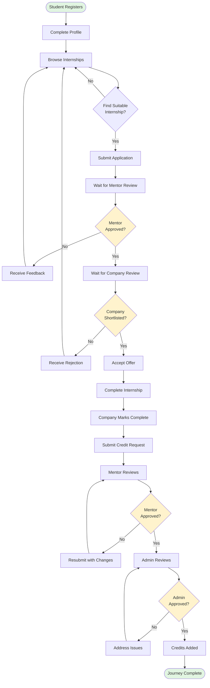

**Student Journey Steps:**

1. **Registration & Profile Setup**
   - Student creates account with email
   - Completes profile with skills, education, interests
   - System calculates readiness score

2. **Browse & Apply**
   - Browse available internships
   - Filter by department, skills, location
   - View AI match scores
   - Submit application with cover letter

3. **Mentor Review**
   - Mentor reviews application
   - Checks student readiness and fit
   - Approves or rejects with feedback

4. **Company Review**
   - Company reviews approved applications
   - Shortlists candidates
   - Provides feedback on rejections

5. **Acceptance**
   - Student accepts offer
   - Application status updated to accepted

6. **Internship Completion**
   - Student completes internship
   - Company marks completion
   - System creates completion record

7. **Credit Request**
   - Student submits credit request
   - Mentor reviews logbook and quality
   - Admin performs final approval
   - Credits added to student account

---

### Company Journey

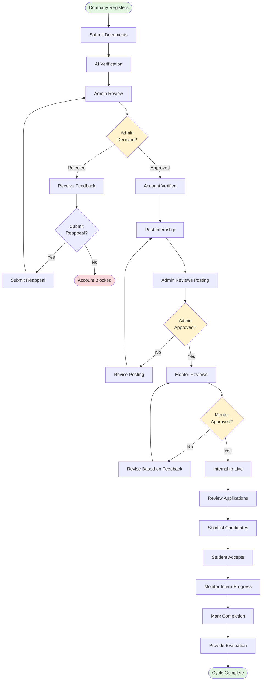

**Company Journey Steps:**

1. **Registration & Verification**
   - Company creates account
   - Uploads verification documents (registration, tax ID, etc.)
   - AI performs initial verification
   - Admin reviews and approves/rejects
   - Option to submit reappeal if rejected

2. **Post Internship**
   - Create internship posting with details
   - Specify requirements, skills, duration
   - Submit for admin review

3. **Admin Approval**
   - Admin checks compliance
   - Verifies company is verified
   - Approves or requests revisions

4. **Mentor Approval**
   - Mentor verifies department fit
   - Checks requirements alignment
   - Approves for student applications

5. **Application Management**
   - Review incoming applications
   - View AI match scores
   - Shortlist or reject candidates
   - Provide feedback

6. **Intern Management**
   - Monitor intern progress
   - Review logbook entries
   - Mark completion when finished
   - Provide evaluation and feedback

---

### Mentor Journey

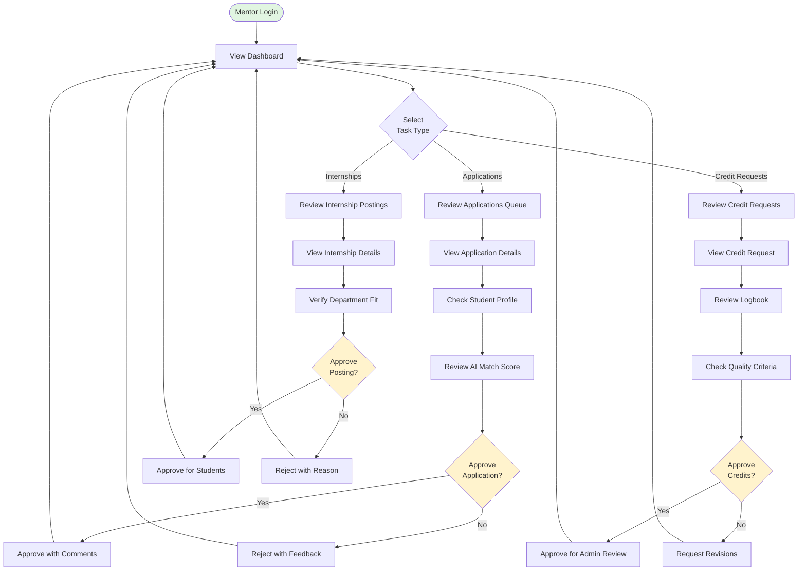

**Mentor Journey Steps:**

1. **Dashboard Overview**
   - View pending tasks count
   - See assigned students
   - Check workload metrics

2. **Application Review**
   - Review applications from assigned students
   - Check student profile and readiness score
   - View AI match score
   - Approve or reject with feedback
   - Forward approved applications to company

3. **Credit Request Review**
   - Review credit requests from students
   - Check internship completion details
   - Review logbook entries
   - Verify quality criteria met
   - Approve for admin review or request revisions

4. **Internship Posting Review**
   - Review internship postings for department
   - Verify requirements and fit
   - Approve or reject with feedback
   - Approved postings become available to students

---

### Admin Journey

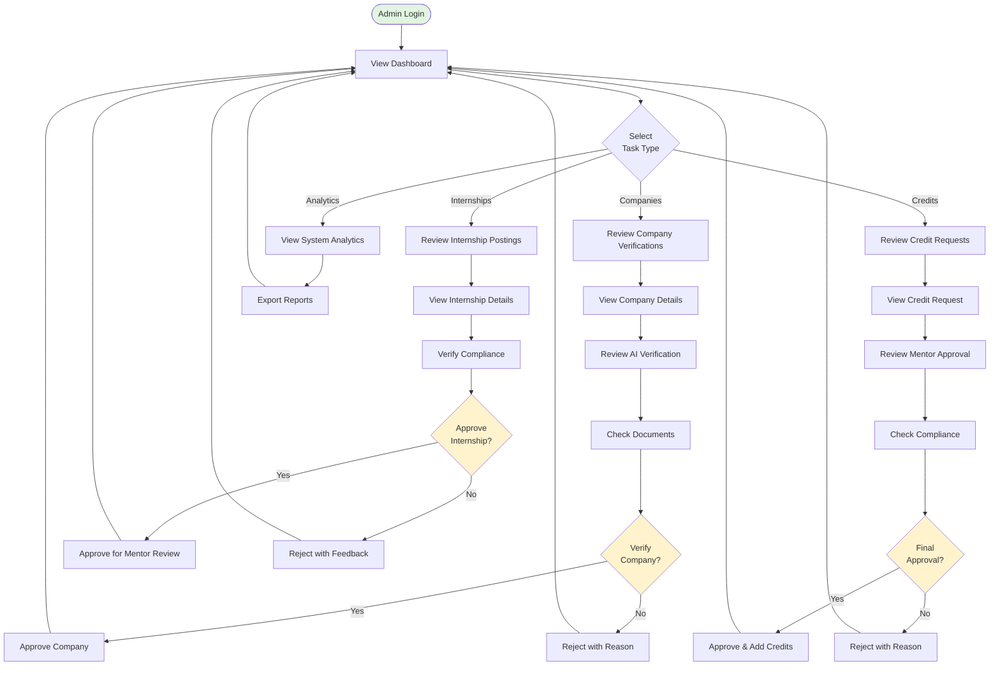

**Admin Journey Steps:**

1. **Dashboard Overview**
   - View system-wide metrics
   - See pending verification counts
   - Monitor system health

2. **Company Verification**
   - Review company registration requests
   - Check AI verification results
   - Review submitted documents
   - Verify company legitimacy
   - Approve or reject with detailed feedback
   - Handle reappeal submissions

3. **Internship Approval**
   - Review internship postings
   - Verify compliance with policies
   - Check company verification status
   - Approve for mentor review or reject
   - Monitor internship lifecycle

4. **Credit Request Final Approval**
   - Review mentor-approved credit requests
   - Verify compliance and quality
   - Check calculation accuracy
   - Perform final approval
   - System adds credits to student account
   - Generate completion certificate

5. **Analytics & Reporting**
   - View system analytics
   - Monitor trends and metrics
   - Export reports for stakeholders
   - Track performance indicators

---

## State Transition Diagrams

### Internship Status Flow

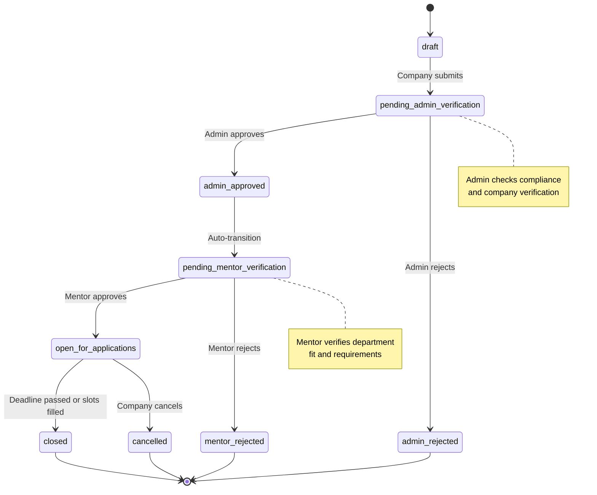

**Internship Status Transitions:**

This table describes all valid status transitions for internships, including who can trigger each transition and under what conditions.

| From Status | To Status | Trigger | Role | Conditions |
|------------|-----------|---------|------|------------|
| draft | pending_admin_verification | Company submits posting | Company | All required fields completed |
| pending_admin_verification | admin_approved | Admin approves | Admin | Company is verified, posting meets compliance |
| pending_admin_verification | admin_rejected | Admin rejects | Admin | Compliance issues or company not verified |
| admin_approved | pending_mentor_verification | Automatic | System | Immediately after admin approval |
| pending_mentor_verification | open_for_applications | Mentor approves | Mentor | Department fit verified |
| pending_mentor_verification | mentor_rejected | Mentor rejects | Mentor | Requirements don't match department |
| open_for_applications | closed | Deadline passed or slots filled | System | Application deadline reached or all slots filled |
| open_for_applications | cancelled | Company cancels | Company | Company decides to cancel posting |

---

### Application Status Flow

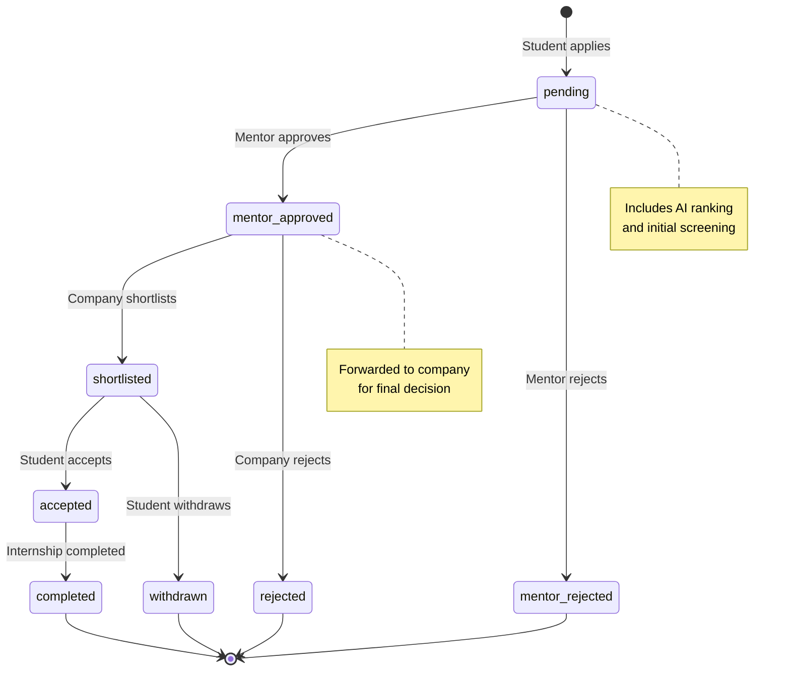

**Application Status Transitions:**

This table describes all valid status transitions for applications throughout the approval workflow.

| From Status | To Status | Trigger | Role | Conditions |
|------------|-----------|---------|------|------------|
| - | pending | Student submits application | Student | Internship is open, student hasn't already applied |
| pending | mentor_approved | Mentor approves | Mentor | Student meets requirements, good fit |
| pending | mentor_rejected | Mentor rejects | Mentor | Student doesn't meet requirements or poor fit |
| mentor_approved | shortlisted | Company shortlists | Company | Candidate meets company criteria |
| mentor_approved | rejected | Company rejects | Company | Candidate doesn't meet company needs |
| shortlisted | accepted | Student accepts offer | Student | Student chooses to accept the offer |
| shortlisted | withdrawn | Student withdraws | Student | Student no longer interested |
| accepted | completed | Internship completed | Company | Internship period finished successfully |

---

### Credit Request Status Flow

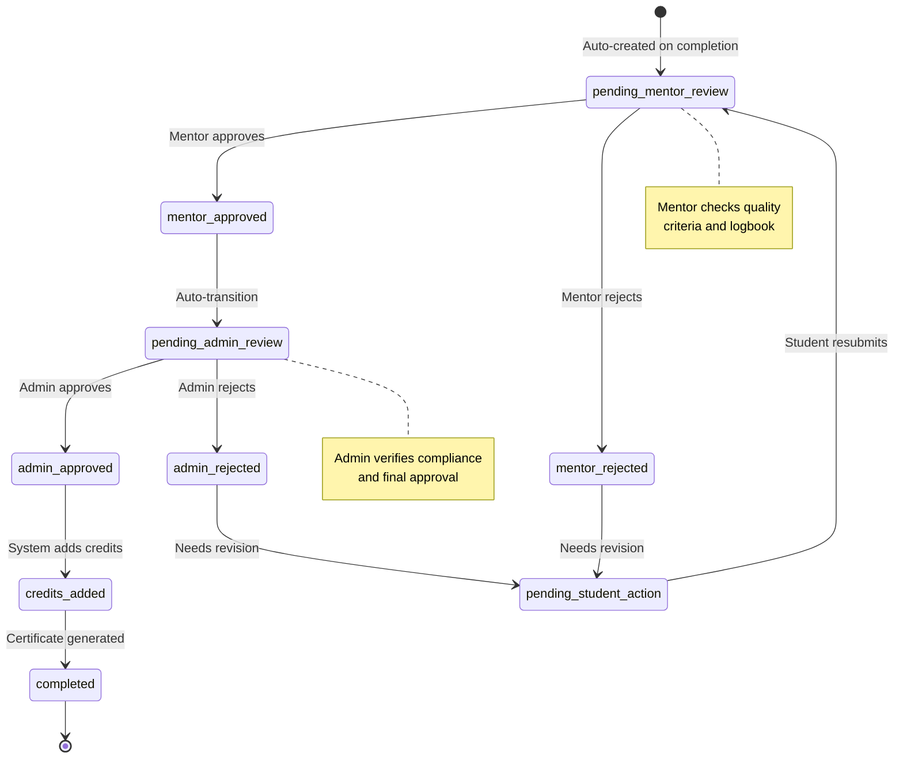

**Credit Request Status Transitions:**

This table describes the multi-stage approval workflow for credit transfer requests.

| From Status | To Status | Trigger | Role | Conditions |
|------------|-----------|---------|------|------------|
| - | pending_mentor_review | Completion marked | System | InternshipCompletion record created |
| pending_mentor_review | mentor_approved | Mentor approves | Mentor | Logbook quality meets standards, hours verified |
| pending_mentor_review | mentor_rejected | Mentor rejects | Mentor | Quality issues or insufficient documentation |
| mentor_rejected | pending_student_action | Needs revision | System | Automatic after mentor rejection |
| pending_student_action | pending_mentor_review | Student resubmits | Student | Student addresses feedback and resubmits |
| mentor_approved | pending_admin_review | Automatic | System | Immediately after mentor approval |
| pending_admin_review | admin_approved | Admin approves | Admin | Compliance verified, calculations correct |
| pending_admin_review | admin_rejected | Admin rejects | Admin | Compliance issues or calculation errors |
| admin_rejected | pending_student_action | Needs revision | System | Automatic after admin rejection |
| admin_approved | credits_added | System processes | System | Credits added to student account |
| credits_added | completed | Certificate generated | System | Certificate PDF generated and stored |

---

### Company Verification Flow

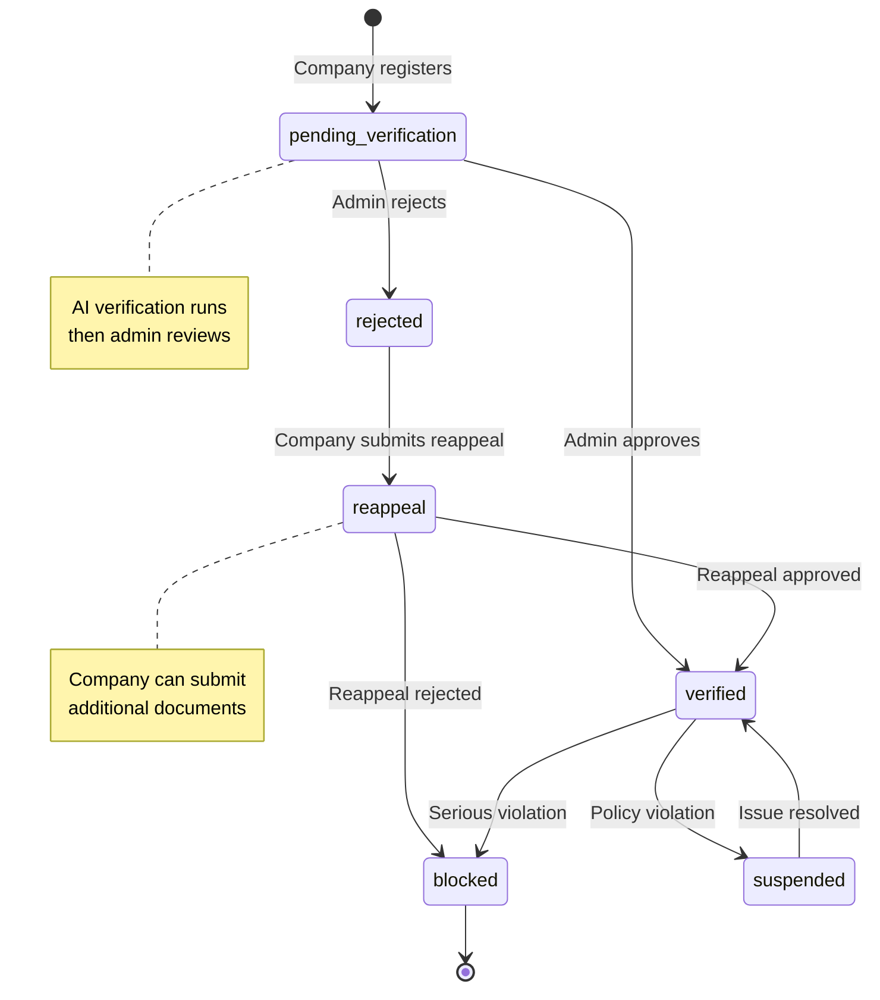

**Company Verification Status Transitions:**

This table describes the company verification and reappeal workflow.

| From Status | To Status | Trigger | Role | Conditions |
|------------|-----------|---------|------|------------|
| - | pending_verification | Company registers | System | Account created, documents uploaded |
| pending_verification | verified | Admin approves | Admin | AI verification passed, documents legitimate |
| pending_verification | rejected | Admin rejects | Admin | AI verification failed or documents invalid |
| rejected | reappeal | Company submits reappeal | Company | Additional documents provided within timeframe |
| reappeal | verified | Reappeal approved | Admin | New evidence satisfactory |
| reappeal | blocked | Reappeal rejected | Admin | Evidence still insufficient, permanently blocked |
| verified | suspended | Policy violation | Admin | Minor policy violation, temporary suspension |
| suspended | verified | Issue resolved | Admin | Company addresses violation |
| verified | blocked | Serious violation | Admin | Major policy violation, permanent block |

---

## API Endpoint Reference

### Authentication Endpoints

These endpoints are used across all user roles for authentication and profile management.

| HTTP Method | Endpoint | Description | Auth Required | Permissions |
|------------|----------|-------------|---------------|-------------|
| POST | `/api/auth/students/register` | Register new student account | No | Public |
| POST | `/api/auth/companies/register` | Register new company account | No | Public |
| POST | `/api/auth/mentors/register` | Register new mentor account | No | Public |
| POST | `/api/auth/admins/register` | Register new admin account | No | Super Admin (production) |
| POST | `/api/auth/login` | User login with Firebase token | No | Public |
| POST | `/api/auth/send-password-reset` | Send password reset email | No | Public |
| POST | `/api/auth/verify-email` | Send email verification link | Yes | All authenticated users |
| GET | `/api/auth/verify-email` | Verify email with code | No | Public |
| GET | `/api/auth/me` | Get current user profile | Yes | All authenticated users |
| PATCH | `/api/auth/me` | Update user profile | Yes | All authenticated users |
| POST | `/api/auth/password` | Change password | Yes | All authenticated users |
| POST | `/api/auth/profile/image` | Upload profile image | Yes | All authenticated users |
| POST | `/api/auth/profile/resume` | Upload resume document | Yes | Student |
| DELETE | `/api/auth/account` | Delete account (soft delete) | Yes | All authenticated users |

---

### Notification Endpoints

These endpoints are used across all user roles for managing notifications.

| HTTP Method | Endpoint | Description | Auth Required | Permissions |
|------------|----------|-------------|---------------|-------------|
| GET | `/api/notifications` | Get user notifications with pagination | Yes | All authenticated users |
| PATCH | `/api/notifications/:id/read` | Mark specific notification as read | Yes | All authenticated users |
| PATCH | `/api/notifications/read-all` | Mark all notifications as read | Yes | All authenticated users |

---

### Student Endpoints

| HTTP Method | Endpoint | Description | Auth Required | Permissions |
|------------|----------|-------------|---------------|-------------|
| GET | `/api/students/dashboard` | Get student dashboard with mentor info | Yes | Student |
| GET | `/api/students/profile` | Get student profile with credits | Yes | Student |
| GET | `/api/students/internships` | Browse available internships with filters | Yes | Student |
| GET | `/api/students/internships/recommended` | Get AI-recommended internships | Yes | Student |
| GET | `/api/students/internships/completed` | Get completed internships with credit status | Yes | Student |
| GET | `/api/students/internships/:internshipId` | Get internship details with match analysis | Yes | Student |
| POST | `/api/students/internships/:internshipId/apply` | Apply to internship with cover letter | Yes | Student |
| GET | `/api/students/applications` | Get student's applications with filters | Yes | Student |
| GET | `/api/students/applications/:applicationId` | Get application details and timeline | Yes | Student |
| DELETE | `/api/students/applications/:applicationId` | Withdraw application | Yes | Student |
| GET | `/api/students/modules/recommended` | Get recommended learning modules | Yes | Student |
| POST | `/api/students/modules/start` | Start a learning module | Yes | Student |
| POST | `/api/students/modules/complete` | Complete a learning module | Yes | Student |
| POST | `/api/students/interviews/start` | Start AI interview practice session | Yes | Student |
| POST | `/api/students/interviews/answer` | Submit interview answer for AI feedback | Yes | Student |
| POST | `/api/students/interviews/end` | End interview practice session | Yes | Student |
| GET | `/api/students/interviews/history` | Get interview practice history | Yes | Student |
| POST | `/api/students/logbooks` | Submit logbook entry | Yes | Student |
| GET | `/api/students/logbooks` | Get student's logbook entries | Yes | Student |
| GET | `/api/students/credits` | Get credits summary | Yes | Student |
| POST | `/api/students/reports/nep` | Generate NEP compliance report | Yes | Student |
| POST | `/api/students/chatbot` | Query AI chatbot for guidance | Yes | Student |
| POST | `/api/students/:studentId/credit-requests` | Create new credit request | Yes | Student |
| GET | `/api/students/:studentId/credit-requests` | Get all credit requests for student | Yes | Student |
| GET | `/api/students/:studentId/credit-requests/:requestId` | Get credit request details | Yes | Student |
| PUT | `/api/students/:studentId/credit-requests/:requestId/resubmit` | Resubmit rejected credit request | Yes | Student |
| GET | `/api/students/:studentId/credit-requests/:requestId/status` | Get real-time credit request status | Yes | Student |
| POST | `/api/students/:studentId/credit-requests/:requestId/reminder` | Send reminder to current reviewer | Yes | Student |
| GET | `/api/students/:studentId/credits/history` | Get credit history | Yes | Student |
| GET | `/api/students/:studentId/credits/certificate/:requestId` | Download credit transfer certificate | Yes | Student |

**Student Workflow Mapping:**

This section maps each step in the student journey (see [Student Journey](#student-journey) diagram) to the specific API endpoints used.

#### 1. Registration & Profile Setup
**Workflow Steps:** Student Registers → Complete Profile

| Step | Endpoint | Method | Description |
|------|----------|--------|-------------|
| Register account | `/api/auth/students/register` | POST | Create new student account with email and password |
| Login | `/api/auth/login` | POST | Authenticate with Firebase token |
| Verify email | `/api/auth/verify-email` | POST | Send email verification link |
| Confirm email | `/api/auth/verify-email` | GET | Verify email with code from link |
| View profile | `/api/students/profile` | GET | Get student profile with readiness score |
| Update profile | `/api/auth/me` | PATCH | Update personal information, skills, education |
| Upload profile image | `/api/auth/profile/image` | POST | Upload profile picture |
| Upload resume | `/api/auth/profile/resume` | POST | Upload resume document |
| View dashboard | `/api/students/dashboard` | GET | View dashboard with mentor info and metrics |

#### 2. Browse & Apply to Internships
**Workflow Steps:** Browse Internships → Find Suitable Internship → Submit Application

| Step | Endpoint | Method | Description |
|------|----------|--------|-------------|
| Browse internships | `/api/students/internships` | GET | List available internships with filters (department, skills, location) |
| Get recommendations | `/api/students/internships/recommended` | GET | Get AI-recommended internships based on profile |
| View internship details | `/api/students/internships/:internshipId` | GET | View full internship details with AI match score |
| Submit application | `/api/students/internships/:internshipId/apply` | POST | Apply to internship with cover letter |

#### 3. Track Applications
**Workflow Steps:** Wait for Mentor Review → Wait for Company Review → Accept Offer

| Step | Endpoint | Method | Description |
|------|----------|--------|-------------|
| View all applications | `/api/students/applications` | GET | List all applications with status and filters |
| Check application status | `/api/students/applications/:applicationId` | GET | View application details, timeline, and feedback |
| Withdraw application | `/api/students/applications/:applicationId` | DELETE | Withdraw pending or shortlisted application |
| Receive notifications | `/api/notifications` | GET | Get notifications about application status changes |

#### 4. Learning & Development
**Workflow Steps:** Complete training modules, practice interviews, get AI guidance

| Step | Endpoint | Method | Description |
|------|----------|--------|-------------|
| Get recommended modules | `/api/students/modules/recommended` | GET | Get personalized learning module recommendations |
| Start module | `/api/students/modules/start` | POST | Begin a learning module |
| Complete module | `/api/students/modules/complete` | POST | Mark module as complete and update readiness score |
| Start interview practice | `/api/students/interviews/start` | POST | Begin AI-powered interview practice session |
| Submit interview answer | `/api/students/interviews/answer` | POST | Submit answer and receive AI feedback |
| End interview session | `/api/students/interviews/end` | POST | Complete interview practice session |
| View interview history | `/api/students/interviews/history` | GET | View past interview practice sessions |
| Get AI guidance | `/api/students/chatbot` | POST | Ask AI chatbot for career guidance |

#### 5. Internship Completion & Credits
**Workflow Steps:** Complete Internship → Company Marks Complete → Submit Credit Request → Mentor Reviews → Admin Reviews → Credits Added

| Step | Endpoint | Method | Description |
|------|----------|--------|-------------|
| View completed internships | `/api/students/internships/completed` | GET | List completed internships with credit request status |
| Submit logbook entry | `/api/students/logbooks` | POST | Submit daily/weekly logbook entry during internship |
| View logbook entries | `/api/students/logbooks` | GET | View all logbook entries |
| Create credit request | `/api/students/:studentId/credit-requests` | POST | Submit credit transfer request after completion |
| View all credit requests | `/api/students/:studentId/credit-requests` | GET | List all credit requests with status |
| View credit request details | `/api/students/:studentId/credit-requests/:requestId` | GET | View detailed credit request with reviews |
| Track credit status | `/api/students/:studentId/credit-requests/:requestId/status` | GET | Get real-time status of credit request |
| Resubmit if rejected | `/api/students/:studentId/credit-requests/:requestId/resubmit` | PUT | Resubmit credit request with revisions |
| Send reminder | `/api/students/:studentId/credit-requests/:requestId/reminder` | POST | Send reminder to current reviewer |
| View credit history | `/api/students/:studentId/credits/history` | GET | View all earned credits history |
| Download certificate | `/api/students/:studentId/credits/certificate/:requestId` | GET | Download credit transfer certificate PDF |
| View credits summary | `/api/students/credits` | GET | View total earned and pending credits |
| Generate NEP report | `/api/students/reports/nep` | POST | Generate NEP compliance report |

#### 6. Notifications
**Workflow Steps:** Receive and manage notifications throughout all workflows

| Step | Endpoint | Method | Description |
|------|----------|--------|-------------|
| View notifications | `/api/notifications` | GET | Get paginated list of notifications |
| Mark notification as read | `/api/notifications/:id/read` | PATCH | Mark specific notification as read |
| Mark all as read | `/api/notifications/read-all` | PATCH | Mark all notifications as read |

---

### Company Endpoints

| HTTP Method | Endpoint | Description | Auth Required | Permissions |
|------------|----------|-------------|---------------|-------------|
| GET | `/api/companies/dashboard` | Get company dashboard with metrics | Yes | Company |
| GET | `/api/companies/profile` | Get company profile | Yes | Company |
| PATCH | `/api/companies/profile` | Update company profile | Yes | Company |
| POST | `/api/companies/documents` | Upload verification documents | Yes | Company |
| GET | `/api/companies/status` | Get verification status | Yes | Company |
| POST | `/api/companies/re-appeal` | Re-appeal rejection (legacy) | Yes | Company (rejected) |
| POST | `/api/companies/reappeal` | Submit reappeal request with documents | Yes | Company (rejected/blocked) |
| GET | `/api/companies/reappeal/status` | Get reappeal status | Yes | Company |
| POST | `/api/companies/internships` | Create new internship posting | Yes | Company (verified) |
| GET | `/api/companies/internships` | Get all company internships | Yes | Company |
| GET | `/api/companies/internships/:internshipId` | Get internship details | Yes | Company |
| PATCH | `/api/companies/internships/:internshipId` | Update internship posting | Yes | Company |
| DELETE | `/api/companies/internships/:internshipId` | Cancel/delete internship | Yes | Company |
| POST | `/api/companies/internships/:internshipId/complete` | Mark internship as complete | Yes | Company |
| GET | `/api/companies/internships/:internshipId/applicants` | Get applicants with filters | Yes | Company |
| GET | `/api/companies/internships/:internshipId/metrics` | Get internship-specific metrics | Yes | Company |
| GET | `/api/companies/applications` | Get all applications to company internships | Yes | Company |
| GET | `/api/companies/applications/:applicationId` | Get application details | Yes | Company |
| POST | `/api/companies/applications/review` | Review applications (bulk) | Yes | Company |
| POST | `/api/companies/applications/shortlist` | Shortlist candidates (bulk) | Yes | Company |
| POST | `/api/companies/applications/reject` | Reject candidates (bulk) | Yes | Company |
| POST | `/api/companies/applications/approve` | Approve single application | Yes | Company |
| POST | `/api/companies/applications/reject-single` | Reject single application | Yes | Company |
| GET | `/api/companies/interns` | Get active interns | Yes | Company |
| GET | `/api/companies/interns/progress` | Get intern progress tracking | Yes | Company |
| GET | `/api/companies/interns/:studentId/logbooks` | Get intern's logbook entries | Yes | Company |
| POST | `/api/companies/interns/:applicationId/complete` | Mark internship as complete | Yes | Company |
| POST | `/api/companies/logbooks/:logbookId/feedback` | Provide logbook feedback | Yes | Company |
| PUT | `/api/companies/completions/:completionId/mark-complete` | Mark completion with evaluation | Yes | Company |
| GET | `/api/companies/completions/completed` | Get list of completed internships | Yes | Company |
| POST | `/api/companies/events` | Create company event | Yes | Company |
| POST | `/api/companies/challenges` | Create coding challenge | Yes | Company |
| GET | `/api/companies/analytics` | Get company analytics with date range | Yes | Company |
| GET | `/api/companies/analytics/export` | Export analytics report (CSV/PDF) | Yes | Company |

**Company Workflow Mapping:**

This section maps each step in the company journey (see [Company Journey](#company-journey) diagram) to the specific API endpoints used.

#### 1. Registration & Verification
**Workflow Steps:** Company Registers → Submit Documents → AI Verification → Admin Review → Account Verified/Rejected

| Step | Endpoint | Method | Description |
|------|----------|--------|-------------|
| Register account | `/api/auth/companies/register` | POST | Create new company account with business details |
| Login | `/api/auth/login` | POST | Authenticate with Firebase token |
| Upload verification documents | `/api/companies/documents` | POST | Upload registration, tax ID, and other verification documents |
| Check verification status | `/api/companies/status` | GET | Check current verification status and AI results |
| Submit reappeal | `/api/companies/reappeal` | POST | Submit reappeal with additional documents if rejected |
| Check reappeal status | `/api/companies/reappeal/status` | GET | Check status of reappeal submission |
| Receive notifications | `/api/notifications` | GET | Get notifications about verification status changes |

#### 2. Profile Management
**Workflow Steps:** Update company information and branding

| Step | Endpoint | Method | Description |
|------|----------|--------|-------------|
| View profile | `/api/companies/profile` | GET | View company profile and verification details |
| Update profile | `/api/companies/profile` | PATCH | Update company information and point of contact |
| Update account info | `/api/auth/me` | PATCH | Update email and account settings |
| Upload profile image | `/api/auth/profile/image` | POST | Upload company logo |

#### 3. Internship Management
**Workflow Steps:** Post Internship → Admin Reviews → Mentor Reviews → Internship Live

| Step | Endpoint | Method | Description |
|------|----------|--------|-------------|
| View dashboard | `/api/companies/dashboard` | GET | View dashboard with metrics and pending tasks |
| Create internship posting | `/api/companies/internships` | POST | Create new internship with requirements and details |
| View all internships | `/api/companies/internships` | GET | List all company internships with status filters |
| View internship details | `/api/companies/internships/:internshipId` | GET | View full internship details and approval status |
| Update internship | `/api/companies/internships/:internshipId` | PATCH | Update internship details (if not yet approved) |
| Delete/cancel internship | `/api/companies/internships/:internshipId` | DELETE | Cancel internship posting |
| Mark internship complete | `/api/companies/internships/:internshipId/complete` | POST | Mark internship period as complete |
| View internship metrics | `/api/companies/internships/:internshipId/metrics` | GET | View application and acceptance metrics |

#### 4. Application Management
**Workflow Steps:** Review Applications → Shortlist Candidates → Student Accepts

| Step | Endpoint | Method | Description |
|------|----------|--------|-------------|
| View all applications | `/api/companies/applications` | GET | List all applications across all internships |
| View applicants for internship | `/api/companies/internships/:internshipId/applicants` | GET | View applicants for specific internship with filters |
| View application details | `/api/companies/applications/:applicationId` | GET | View full application with student profile and AI ranking |
| Approve single application | `/api/companies/applications/approve` | POST | Shortlist a single candidate |
| Reject single application | `/api/companies/applications/reject-single` | POST | Reject a single application with feedback |
| Bulk shortlist candidates | `/api/companies/applications/shortlist` | POST | Shortlist multiple candidates at once |
| Bulk reject candidates | `/api/companies/applications/reject` | POST | Reject multiple applications with feedback |
| Review applications (bulk) | `/api/companies/applications/review` | POST | Bulk review and update application statuses |

#### 5. Intern Management
**Workflow Steps:** Monitor Intern Progress → Mark Completion → Provide Evaluation

| Step | Endpoint | Method | Description |
|------|----------|--------|-------------|
| View active interns | `/api/companies/interns` | GET | List all currently active interns |
| Track intern progress | `/api/companies/interns/progress` | GET | View progress tracking for all interns |
| View intern logbooks | `/api/companies/interns/:studentId/logbooks` | GET | View logbook entries for specific intern |
| Provide logbook feedback | `/api/companies/logbooks/:logbookId/feedback` | POST | Provide feedback on logbook entry |
| Mark internship complete | `/api/companies/interns/:applicationId/complete` | POST | Mark internship as complete for student |
| Submit completion evaluation | `/api/companies/completions/:completionId/mark-complete` | PUT | Submit final evaluation and completion details |
| View completed internships | `/api/companies/completions/completed` | GET | List all completed internships |

#### 6. Analytics & Reporting
**Workflow Steps:** View performance metrics and export reports

| Step | Endpoint | Method | Description |
|------|----------|--------|-------------|
| View analytics dashboard | `/api/companies/analytics` | GET | View company analytics with date range filters |
| Export analytics report | `/api/companies/analytics/export` | GET | Export analytics as CSV or PDF |

#### 7. Events & Challenges (Optional Features)
**Workflow Steps:** Create company events and coding challenges

| Step | Endpoint | Method | Description |
|------|----------|--------|-------------|
| Create company event | `/api/companies/events` | POST | Create networking or recruitment event |
| Create coding challenge | `/api/companies/challenges` | POST | Create coding challenge for students |

#### 8. Notifications
**Workflow Steps:** Receive and manage notifications throughout all workflows

| Step | Endpoint | Method | Description |
|------|----------|--------|-------------|
| View notifications | `/api/notifications` | GET | Get paginated list of notifications |
| Mark notification as read | `/api/notifications/:id/read` | PATCH | Mark specific notification as read |
| Mark all as read | `/api/notifications/read-all` | PATCH | Mark all notifications as read |

---

### Mentor Endpoints

| HTTP Method | Endpoint | Description | Auth Required | Permissions |
|------------|----------|-------------|---------------|-------------|
| GET | `/api/mentors/dashboard` | Get mentor dashboard with metrics | Yes | Mentor |
| GET | `/api/mentor/profile` | Get mentor profile | Yes | Mentor |
| PUT | `/api/mentor/profile` | Update mentor profile | Yes | Mentor |
| GET | `/api/mentors/students` | Get assigned students (legacy) | Yes | Mentor |
| GET | `/api/mentor/students/list` | Get assigned students with filters | Yes | Mentor |
| GET | `/api/mentor/students/:studentId/details` | Get student details with history | Yes | Mentor |
| GET | `/api/mentor/students/:studentId/applications` | Get student's applications | Yes | Mentor |
| GET | `/api/mentors/students/:studentId/progress` | Get student progress tracking | Yes | Mentor |
| GET | `/api/mentors/applications/pending` | Get pending applications queue | Yes | Mentor |
| GET | `/api/mentors/applications/:applicationId` | Get application details | Yes | Mentor |
| POST | `/api/mentors/applications/:applicationId/approve` | Approve application | Yes | Mentor |
| POST | `/api/mentors/applications/:applicationId/reject` | Reject application with feedback | Yes | Mentor |
| GET | `/api/mentor/internships/pending` | Get pending internships for approval | Yes | Mentor |
| GET | `/api/mentor/internships` | Get all internships with filtering | Yes | Mentor |
| GET | `/api/mentor/internships/:internshipId` | Get internship details for review | Yes | Mentor |
| POST | `/api/mentor/internships/:internshipId/approve` | Approve internship for department | Yes | Mentor |
| POST | `/api/mentor/internships/:internshipId/reject` | Reject internship with reasons | Yes | Mentor |
| GET | `/api/mentors/logbooks/pending` | Get pending logbooks for review | Yes | Mentor |
| GET | `/api/mentors/logbooks/:logbookId` | Get logbook details | Yes | Mentor |
| POST | `/api/mentors/logbooks/:logbookId/approve` | Approve logbook entry | Yes | Mentor |
| POST | `/api/mentors/logbooks/:logbookId/revision` | Request logbook revision | Yes | Mentor |
| GET | `/api/mentors/credits/pending` | Get pending credit requests (legacy) | Yes | Mentor |
| POST | `/api/mentors/credits/:requestId/decide` | Approve/reject credit request (legacy) | Yes | Mentor |
| GET | `/api/mentors/:mentorId/credit-requests/pending` | Get pending credit requests | Yes | Mentor |
| GET | `/api/mentors/:mentorId/credit-requests/:requestId` | Get credit request details | Yes | Mentor |
| POST | `/api/mentors/:mentorId/credit-requests/:requestId/review` | Submit mentor review (approve/reject) | Yes | Mentor |
| GET | `/api/mentors/:mentorId/credit-requests/history` | Get mentor's review history | Yes | Mentor |
| GET | `/api/mentors/:mentorId/credit-requests/analytics` | Get mentor review analytics | Yes | Mentor |
| GET | `/api/mentors/skill-gaps` | Get skill gap analysis | Yes | Mentor |
| GET | `/api/mentors/department/performance` | Get department performance metrics | Yes | Mentor |
| POST | `/api/mentors/interventions` | Create student intervention | Yes | Mentor |
| GET | `/api/mentors/interventions` | Get all interventions | Yes | Mentor |
| GET | `/api/mentor/analytics` | Get mentor-specific analytics | Yes | Mentor |
| GET | `/api/mentor/analytics/department` | Get department analytics | Yes | Mentor |

**Mentor Workflow Mapping:**

This section maps each step in the mentor journey (see [Mentor Journey](#mentor-journey) diagram) to the specific API endpoints used.

#### 1. Dashboard & Overview
**Workflow Steps:** Mentor Login → View Dashboard → Select Task Type

| Step | Endpoint | Method | Description |
|------|----------|--------|-------------|
| Login | `/api/auth/login` | POST | Authenticate with Firebase token |
| View dashboard | `/api/mentors/dashboard` | GET | View dashboard with pending tasks and metrics |
| View profile | `/api/mentor/profile` | GET | View mentor profile and workload |
| Update profile | `/api/mentor/profile` | PUT | Update mentor information and preferences |
| Update account info | `/api/auth/me` | PATCH | Update email and account settings |

#### 2. Student Management
**Workflow Steps:** View and manage assigned students

| Step | Endpoint | Method | Description |
|------|----------|--------|-------------|
| View assigned students | `/api/mentor/students/list` | GET | List all assigned students with filters |
| View student details | `/api/mentor/students/:studentId/details` | GET | View student profile, history, and performance |
| View student applications | `/api/mentor/students/:studentId/applications` | GET | View all applications from specific student |
| Track student progress | `/api/mentors/students/:studentId/progress` | GET | View detailed progress tracking for student |
| Create intervention | `/api/mentors/interventions` | POST | Create intervention for struggling student |
| View interventions | `/api/mentors/interventions` | GET | View all student interventions |
| View assigned students (legacy) | `/api/mentors/students` | GET | Legacy endpoint for assigned students |

#### 3. Application Review
**Workflow Steps:** Review Applications Queue → View Application Details → Check Student Profile → Review AI Match Score → Approve/Reject

| Step | Endpoint | Method | Description |
|------|----------|--------|-------------|
| View pending applications | `/api/mentors/applications/pending` | GET | Get queue of applications awaiting mentor review |
| View application details | `/api/mentors/applications/:applicationId` | GET | View full application with student profile and AI ranking |
| Approve application | `/api/mentors/applications/:applicationId/approve` | POST | Approve application and forward to company |
| Reject application | `/api/mentors/applications/:applicationId/reject` | POST | Reject application with constructive feedback |

#### 4. Internship Approval
**Workflow Steps:** Review Internship Postings → View Internship Details → Verify Department Fit → Approve/Reject

| Step | Endpoint | Method | Description |
|------|----------|--------|-------------|
| View pending internships | `/api/mentor/internships/pending` | GET | Get queue of internships awaiting mentor approval |
| View all internships | `/api/mentor/internships` | GET | List all internships with filtering options |
| View internship details | `/api/mentor/internships/:internshipId` | GET | View full internship details for review |
| Approve internship | `/api/mentor/internships/:internshipId/approve` | POST | Approve internship for department students |
| Reject internship | `/api/mentor/internships/:internshipId/reject` | POST | Reject internship with reasons and feedback |

#### 5. Logbook Review
**Workflow Steps:** Review logbook entries from students during internships

| Step | Endpoint | Method | Description |
|------|----------|--------|-------------|
| View pending logbooks | `/api/mentors/logbooks/pending` | GET | Get queue of logbooks awaiting review |
| View logbook details | `/api/mentors/logbooks/:logbookId` | GET | View full logbook entry with attachments |
| Approve logbook | `/api/mentors/logbooks/:logbookId/approve` | POST | Approve logbook entry |
| Request revision | `/api/mentors/logbooks/:logbookId/revision` | POST | Request revisions to logbook entry |

#### 6. Credit Request Review
**Workflow Steps:** Review Credit Requests → Review Logbook → Check Quality Criteria → Approve/Request Revisions

| Step | Endpoint | Method | Description |
|------|----------|--------|-------------|
| View pending credit requests | `/api/mentors/:mentorId/credit-requests/pending` | GET | Get queue of credit requests awaiting mentor review |
| View credit request details | `/api/mentors/:mentorId/credit-requests/:requestId` | GET | View full credit request with completion details |
| Submit review decision | `/api/mentors/:mentorId/credit-requests/:requestId/review` | POST | Approve or reject credit request with comments |
| View review history | `/api/mentors/:mentorId/credit-requests/history` | GET | View history of all credit request reviews |
| View review analytics | `/api/mentors/:mentorId/credit-requests/analytics` | GET | View analytics on credit request reviews |
| View pending credits (legacy) | `/api/mentors/credits/pending` | GET | Legacy endpoint for pending credit requests |
| Decide on credit (legacy) | `/api/mentors/credits/:requestId/decide` | POST | Legacy endpoint for credit decision |

#### 7. Analytics & Reporting
**Workflow Steps:** View performance metrics and insights

| Step | Endpoint | Method | Description |
|------|----------|--------|-------------|
| View mentor analytics | `/api/mentor/analytics` | GET | View personal mentoring analytics and metrics |
| View department analytics | `/api/mentor/analytics/department` | GET | View department-wide analytics |
| View department performance | `/api/mentors/department/performance` | GET | View detailed department performance metrics |
| View skill gap analysis | `/api/mentors/skill-gaps` | GET | View skill gap analysis for students |

#### 8. Notifications
**Workflow Steps:** Receive and manage notifications throughout all workflows

| Step | Endpoint | Method | Description |
|------|----------|--------|-------------|
| View notifications | `/api/notifications` | GET | Get paginated list of notifications |
| Mark notification as read | `/api/notifications/:id/read` | PATCH | Mark specific notification as read |
| Mark all as read | `/api/notifications/read-all` | PATCH | Mark all notifications as read |

---

### Admin Endpoints

| HTTP Method | Endpoint | Description | Auth Required | Permissions |
|------------|----------|-------------|---------------|-------------|
| GET | `/api/admin/dashboard` | Get admin dashboard with metrics | Yes | Admin |
| GET | `/api/admin/companies` | Get companies pending verification | Yes | Admin |
| GET | `/api/companies/:id` | Get company details | Yes | Admin |
| PUT | `/api/admin/companies/:id/verify` | Verify/reject company | Yes | Admin |
| PUT | `/api/admin/companies/:id/status` | Update company status | Yes | Admin |
| GET | `/api/admin/internships` | Get internships pending approval | Yes | Admin |
| GET | `/api/internships/:id` | Get internship details | Yes | Admin |
| PUT | `/api/admin/internships/:id/review` | Approve/reject internship | Yes | Admin |
| GET | `/api/admin/applications` | Get all applications | Yes | Admin |
| GET | `/api/admin/credit-requests` | Get credit requests for review | Yes | Admin |
| GET | `/api/credit-requests/:id` | Get credit request details | Yes | Admin |
| PUT | `/api/admin/credit-requests/:id/review` | Final approval/rejection | Yes | Admin |
| GET | `/api/admin/students` | Get all students | Yes | Admin |
| GET | `/api/admin/mentors` | Get all mentors | Yes | Admin |
| POST | `/api/admin/mentors` | Create mentor account | Yes | Admin (super) |
| PUT | `/api/admin/mentors/:id` | Update mentor details | Yes | Admin (super) |
| GET | `/api/admin/analytics` | Get system analytics | Yes | Admin |
| POST | `/api/admin/analytics/export` | Export analytics reports | Yes | Admin |
| GET | `/api/admin/audit-logs` | Get audit logs | Yes | Admin (super) |
| GET | `/api/notifications` | Get notifications | Yes | Admin |

**Admin Workflow Mapping:**

This section maps each step in the admin journey (see [Admin Journey](#admin-journey) diagram) to the specific API endpoints used.

#### 1. Dashboard & Overview
**Workflow Steps:** Admin Login → View Dashboard → Select Task Type

| Step | Endpoint | Method | Description |
|------|----------|--------|-------------|
| Login | `/api/auth/login` | POST | Authenticate with Firebase token |
| View dashboard | `/api/admin/dashboard` | GET | View system-wide dashboard with pending tasks and metrics |
| Update account info | `/api/auth/me` | PATCH | Update email and account settings |

#### 2. Company Verification
**Workflow Steps:** Review Company Verifications → View Company Details → Review AI Verification → Check Documents → Verify/Reject

| Step | Endpoint | Method | Description |
|------|----------|--------|-------------|
| View companies pending verification | `/api/admin/companies` | GET | List companies awaiting verification with filters |
| View company details | `/api/companies/:id` | GET | View full company details, documents, and AI verification |
| Verify or reject company | `/api/admin/companies/:id/verify` | PUT | Approve or reject company with detailed feedback |
| Update company status | `/api/admin/companies/:id/status` | PUT | Update company status (suspend, block, reactivate) |

#### 3. Internship Approval
**Workflow Steps:** Review Internship Postings → View Internship Details → Verify Compliance → Approve/Reject

| Step | Endpoint | Method | Description |
|------|----------|--------|-------------|
| View internships pending approval | `/api/admin/internships` | GET | List internships awaiting admin approval |
| View internship details | `/api/internships/:id` | GET | View full internship details and company verification |
| Approve or reject internship | `/api/admin/internships/:id/review` | PUT | Approve for mentor review or reject with feedback |

#### 4. Credit Request Final Approval
**Workflow Steps:** Review Credit Requests → Review Mentor Approval → Check Compliance → Final Approval/Rejection

| Step | Endpoint | Method | Description |
|------|----------|--------|-------------|
| View credit requests for review | `/api/admin/credit-requests` | GET | List credit requests awaiting final admin approval |
| View credit request details | `/api/credit-requests/:id` | GET | View full credit request with mentor review |
| Final approval or rejection | `/api/admin/credit-requests/:id/review` | PUT | Perform final approval and trigger credit addition |

#### 5. User Management
**Workflow Steps:** Manage system users and permissions

| Step | Endpoint | Method | Description |
|------|----------|--------|-------------|
| View all students | `/api/admin/students` | GET | List all students with filters and search |
| View all mentors | `/api/admin/mentors` | GET | List all mentors with workload info |
| Create mentor account | `/api/admin/mentors` | POST | Create new mentor account (super admin only) |
| Update mentor details | `/api/admin/mentors/:id` | PUT | Update mentor information (super admin only) |
| View all applications | `/api/admin/applications` | GET | View all applications across the system |

#### 6. Analytics & Reporting
**Workflow Steps:** View System Analytics → Export Reports

| Step | Endpoint | Method | Description |
|------|----------|--------|-------------|
| View system analytics | `/api/admin/analytics` | GET | View comprehensive system analytics with date ranges |
| Export analytics reports | `/api/admin/analytics/export` | POST | Export analytics as CSV or PDF reports |
| View audit logs | `/api/admin/audit-logs` | GET | View system audit logs (super admin only) |

#### 7. Notifications
**Workflow Steps:** Receive and manage notifications throughout all workflows

| Step | Endpoint | Method | Description |
|------|----------|--------|-------------|
| View notifications | `/api/notifications` | GET | Get paginated list of notifications |
| Mark notification as read | `/api/notifications/:id/read` | PATCH | Mark specific notification as read |
| Mark all as read | `/api/notifications/read-all` | PATCH | Mark all notifications as read |

---

### Common Request/Response Formats

All API responses follow consistent formats for success, error, and paginated data.

**Success Response:**
```json
{
  "success": true,
  "data": {
    // Response data (object or array)
  },
  "message": "Operation successful"
}
```

**Example - Get Student Profile:**
```json
{
  "success": true,
  "data": {
    "studentId": "STU-2024-001",
    "email": "student@example.com",
    "profile": {
      "name": "John Doe",
      "department": "Computer Science"
    },
    "readinessScore": 85,
    "credits": {
      "earned": 12,
      "pending": 4
    }
  },
  "message": "Profile retrieved successfully"
}
```

**Error Response:**
```json
{
  "success": false,
  "error": {
    "code": "ERROR_CODE",
    "message": "Human-readable error message",
    "details": {}
  }
}
```

**Example - Validation Error:**
```json
{
  "success": false,
  "error": {
    "code": "VALIDATION_ERROR",
    "message": "Invalid request data",
    "details": {
      "fields": {
        "email": "Email is required",
        "coverLetter": "Cover letter must be at least 100 characters"
      }
    }
  }
}
```

**Pagination Response:**
```json
{
  "success": true,
  "data": {
    "items": [],
    "pagination": {
      "page": 1,
      "limit": 20,
      "total": 100,
      "pages": 5
    }
  }
}
```

**Example - Paginated Internships:**
```json
{
  "success": true,
  "data": {
    "items": [
      {
        "internshipId": "INT-2024-001",
        "title": "Software Engineering Intern",
        "companyName": "Tech Corp",
        "department": "Computer Science",
        "slotsRemaining": 3
      }
    ],
    "pagination": {
      "page": 1,
      "limit": 20,
      "total": 45,
      "pages": 3
    }
  },
  "message": "Internships retrieved successfully"
}
```

### Common Error Codes

| Error Code | HTTP Status | Description | Resolution |
|-----------|-------------|-------------|------------|
| `AUTH_REQUIRED` | 401 | Authentication token missing or invalid | Provide valid Firebase authentication token in Authorization header |
| `FORBIDDEN` | 403 | User lacks permission for this action | Check user role and permissions for the requested endpoint |
| `NOT_FOUND` | 404 | Requested resource doesn't exist | Verify the resource ID exists and user has access |
| `VALIDATION_ERROR` | 400 | Request data validation failed | Check request body against API documentation and fix validation errors |
| `STATE_TRANSITION_ERROR` | 400 | Invalid status transition attempted | Review state transition diagrams for valid transitions |
| `DUPLICATE_ENTRY` | 409 | Resource already exists | Check if resource already exists before creating |
| `QUOTA_EXCEEDED` | 429 | Rate limit or quota exceeded | Implement exponential backoff and retry logic |
| `INTERNAL_ERROR` | 500 | Internal server error | Contact support if error persists |

### API Best Practices

**Authentication:**
- Always include Firebase authentication token in `Authorization` header
- Format: `Bearer <firebase_token>`
- Tokens expire after 1 hour - implement token refresh logic

**Error Handling:**
- Always check the `success` field in responses
- Parse error codes and display user-friendly messages
- Log error details for debugging

**Pagination:**
- Use `page` and `limit` query parameters for list endpoints
- Default limit is 20, maximum is 100
- Always check `pagination.total` to determine if more pages exist

**Rate Limiting:**
- Implement exponential backoff for rate limit errors
- Cache frequently accessed data on the client side
- Batch operations when possible

**Status Polling:**
- Use WebSocket connections for real-time updates when available
- For polling, use reasonable intervals (30-60 seconds minimum)
- Implement exponential backoff for polling

---

## Workflow-to-Endpoint Cross-Reference

This section provides a comprehensive mapping of all major workflows to their corresponding API endpoints, organized by workflow type.

### Application Approval Workflow

**Flow:** Student → Mentor → Company → Student → Completion

| Workflow Step | Role | Endpoint | Method | Description |
|--------------|------|----------|--------|-------------|
| 1. Submit application | Student | `/api/students/internships/:internshipId/apply` | POST | Student applies to internship |
| 2. View pending applications | Mentor | `/api/mentors/applications/pending` | GET | Mentor sees pending applications |
| 3. Review application | Mentor | `/api/mentors/applications/:applicationId` | GET | Mentor views application details |
| 4. Approve application | Mentor | `/api/mentors/applications/:applicationId/approve` | POST | Mentor approves and forwards to company |
| 5. Receive notification | Student | `/api/notifications` | GET | Student notified of mentor approval |
| 6. View applicants | Company | `/api/companies/internships/:internshipId/applicants` | GET | Company views approved applicants |
| 7. Review application | Company | `/api/companies/applications/:applicationId` | GET | Company reviews application details |
| 8. Shortlist candidate | Company | `/api/companies/applications/approve` | POST | Company shortlists candidate |
| 9. Receive notification | Student | `/api/notifications` | GET | Student notified of shortlisting |
| 10. Check application status | Student | `/api/students/applications/:applicationId` | GET | Student views updated status |
| 11. Accept offer | Student | (Implicit in status) | - | Student accepts through application status |
| 12. Mark completion | Company | `/api/companies/completions/:completionId/mark-complete` | PUT | Company marks internship complete |

### Credit Transfer Workflow

**Flow:** Completion → Mentor → Admin → Credits Added

| Workflow Step | Role | Endpoint | Method | Description |
|--------------|------|----------|--------|-------------|
| 1. Mark completion | Company | `/api/companies/completions/:completionId/mark-complete` | PUT | Company marks internship complete |
| 2. Auto-create credit request | System | (Automatic) | - | System creates credit request |
| 3. View completed internships | Student | `/api/students/internships/completed` | GET | Student sees completion |
| 4. Create credit request | Student | `/api/students/:studentId/credit-requests` | POST | Student submits credit request |
| 5. View pending requests | Mentor | `/api/mentors/:mentorId/credit-requests/pending` | GET | Mentor sees pending requests |
| 6. Review credit request | Mentor | `/api/mentors/:mentorId/credit-requests/:requestId` | GET | Mentor reviews details |
| 7. Submit mentor review | Mentor | `/api/mentors/:mentorId/credit-requests/:requestId/review` | POST | Mentor approves/rejects |
| 8. Receive notification | Student | `/api/notifications` | GET | Student notified of mentor decision |
| 9. Resubmit if rejected | Student | `/api/students/:studentId/credit-requests/:requestId/resubmit` | PUT | Student resubmits with changes |
| 10. View pending admin reviews | Admin | `/api/admin/credit-requests` | GET | Admin sees mentor-approved requests |
| 11. Review credit request | Admin | `/api/credit-requests/:id` | GET | Admin reviews details |
| 12. Final approval | Admin | `/api/admin/credit-requests/:id/review` | PUT | Admin performs final approval |
| 13. Credits added | System | (Automatic) | - | System adds credits to student |
| 14. View credit history | Student | `/api/students/:studentId/credits/history` | GET | Student sees updated credits |
| 15. Download certificate | Student | `/api/students/:studentId/credits/certificate/:requestId` | GET | Student downloads certificate |

### Internship Posting Workflow

**Flow:** Company → Admin → Mentor → Live

| Workflow Step | Role | Endpoint | Method | Description |
|--------------|------|----------|--------|-------------|
| 1. Create internship | Company | `/api/companies/internships` | POST | Company creates posting |
| 2. View pending internships | Admin | `/api/admin/internships` | GET | Admin sees pending postings |
| 3. Review internship | Admin | `/api/internships/:id` | GET | Admin reviews details |
| 4. Approve internship | Admin | `/api/admin/internships/:id/review` | PUT | Admin approves for mentor review |
| 5. Receive notification | Company | `/api/notifications` | GET | Company notified of admin approval |
| 6. View pending internships | Mentor | `/api/mentor/internships/pending` | GET | Mentor sees pending approvals |
| 7. Review internship | Mentor | `/api/mentor/internships/:internshipId` | GET | Mentor reviews details |
| 8. Approve internship | Mentor | `/api/mentor/internships/:internshipId/approve` | POST | Mentor approves for students |
| 9. Receive notification | Company | `/api/notifications` | GET | Company notified internship is live |
| 10. Browse internships | Student | `/api/students/internships` | GET | Students can now see posting |

### Company Verification Workflow

**Flow:** Registration → AI Check → Admin Review → Verified/Rejected

| Workflow Step | Role | Endpoint | Method | Description |
|--------------|------|----------|--------|-------------|
| 1. Register company | Company | `/api/auth/companies/register` | POST | Company creates account |
| 2. Upload documents | Company | `/api/companies/documents` | POST | Company uploads verification docs |
| 3. AI verification | System | (Automatic) | - | AI analyzes documents |
| 4. Check status | Company | `/api/companies/status` | GET | Company checks verification status |
| 5. View pending companies | Admin | `/api/admin/companies` | GET | Admin sees pending verifications |
| 6. Review company | Admin | `/api/companies/:id` | GET | Admin reviews details and AI results |
| 7. Verify or reject | Admin | `/api/admin/companies/:id/verify` | PUT | Admin makes decision |
| 8. Receive notification | Company | `/api/notifications` | GET | Company notified of decision |
| 9. Submit reappeal (if rejected) | Company | `/api/companies/reappeal` | POST | Company submits reappeal |
| 10. Check reappeal status | Company | `/api/companies/reappeal/status` | GET | Company checks reappeal status |
| 11. Review reappeal | Admin | `/api/companies/:id` | GET | Admin reviews reappeal |
| 12. Decide on reappeal | Admin | `/api/admin/companies/:id/verify` | PUT | Admin approves or blocks |

### Student Learning & Development Workflow

**Flow:** Browse Modules → Complete Training → Practice Interviews → Improve Readiness

| Workflow Step | Role | Endpoint | Method | Description |
|--------------|------|----------|--------|-------------|
| 1. View dashboard | Student | `/api/students/dashboard` | GET | Student sees readiness score |
| 2. Get recommendations | Student | `/api/students/modules/recommended` | GET | Get personalized module recommendations |
| 3. Start module | Student | `/api/students/modules/start` | POST | Begin learning module |
| 4. Complete module | Student | `/api/students/modules/complete` | POST | Complete module and update score |
| 5. Start interview practice | Student | `/api/students/interviews/start` | POST | Begin AI interview practice |
| 6. Submit answers | Student | `/api/students/interviews/answer` | POST | Submit answers for AI feedback |
| 7. End interview | Student | `/api/students/interviews/end` | POST | Complete interview session |
| 8. View history | Student | `/api/students/interviews/history` | GET | Review past practice sessions |
| 9. Get AI guidance | Student | `/api/students/chatbot` | POST | Ask AI for career guidance |
| 10. View updated profile | Student | `/api/students/profile` | GET | See updated readiness score |

### Logbook Management Workflow

**Flow:** Student Submits → Company Reviews → Mentor Reviews

| Workflow Step | Role | Endpoint | Method | Description |
|--------------|------|----------|--------|-------------|
| 1. Submit logbook entry | Student | `/api/students/logbooks` | POST | Student submits daily/weekly entry |
| 2. View intern logbooks | Company | `/api/companies/interns/:studentId/logbooks` | GET | Company views logbook entries |
| 3. Provide feedback | Company | `/api/companies/logbooks/:logbookId/feedback` | POST | Company provides feedback |
| 4. View pending logbooks | Mentor | `/api/mentors/logbooks/pending` | GET | Mentor sees pending reviews |
| 5. Review logbook | Mentor | `/api/mentors/logbooks/:logbookId` | GET | Mentor reviews entry |
| 6. Approve or request revision | Mentor | `/api/mentors/logbooks/:logbookId/approve` | POST | Mentor approves or requests changes |
| 7. Receive notification | Student | `/api/notifications` | GET | Student notified of feedback |
| 8. View logbooks | Student | `/api/students/logbooks` | GET | Student sees feedback and status |

---

## Quick Reference

### Entity Quick Reference

#### Student
- **ID Format**: `STU-YYYY-NNN`
- **Key Fields**: studentId, email, profile, readinessScore, credits
- **Status Values**: active, inactive, suspended
- **Relationships**: Applications, CreditRequests, InternshipCompletions, Mentor

#### Company
- **ID Format**: `COM-YYYY-NNN`
- **Key Fields**: companyId, companyName, email, status, documents
- **Status Values**: pending_verification, verified, rejected, blocked, reappeal, suspended
- **Relationships**: Internships, Applications

#### Mentor
- **ID Format**: `MEN-YYYY-NNN`
- **Key Fields**: mentorId, email, profile, assignedStudents, workload
- **Status Values**: active, inactive, on_leave
- **Relationships**: Students, Applications, CreditRequests

#### Admin
- **ID Format**: `ADM-YYYY-NNN`
- **Key Fields**: adminId, email, name, role, permissions
- **Roles**: super_admin, admin, support
- **Status Values**: active, inactive

#### Internship
- **ID Format**: `INT-YYYY-NNN`
- **Key Fields**: internshipId, companyId, title, department, status, slots
- **Status Values**: draft, pending_admin_verification, admin_approved, pending_mentor_verification, open_for_applications, closed, cancelled
- **Relationships**: Company, Applications, InternshipCompletions

#### Application
- **ID Format**: `APP-YYYY-NNN`
- **Key Fields**: applicationId, studentId, internshipId, status, aiRanking
- **Status Values**: pending, mentor_approved, mentor_rejected, shortlisted, rejected, accepted, withdrawn, completed
- **Relationships**: Student, Internship, Company, InternshipCompletion

#### InternshipCompletion
- **ID Format**: `CMP-YYYY-NNN`
- **Key Fields**: completionId, studentId, internshipId, totalHours, creditsEarned
- **Status Values**: pending, completed, verified
- **Relationships**: Student, Internship, Application, CreditRequest

#### CreditRequest
- **ID Format**: `CR-YYYY-NNN`
- **Key Fields**: creditRequestId, studentId, internshipCompletionId, requestedCredits, status
- **Status Values**: pending_mentor_review, mentor_approved, mentor_rejected, pending_admin_review, admin_approved, admin_rejected, pending_student_action, credits_added, completed
- **Relationships**: Student, InternshipCompletion, Mentor

#### Notification
- **ID Format**: `NOT-YYYY-NNN`
- **Key Fields**: notificationId, userId, role, type, title, message, priority, read
- **Priority Values**: low, medium, high, critical
- **Role Values**: student, mentor, admin, company
- **Delivery Channels**: email, sms, whatsapp, push
- **Relationships**: Student, Company, Mentor, Admin (polymorphic via userId and role)

---

### Status Values

#### Internship Status
1. `draft` - Initial creation by company
2. `pending_admin_verification` - Submitted for admin review
3. `admin_approved` - Admin approved, awaiting mentor
4. `admin_rejected` - Rejected by admin
5. `pending_mentor_verification` - Awaiting mentor approval
6. `mentor_rejected` - Rejected by mentor
7. `open_for_applications` - Live and accepting applications
8. `closed` - Deadline passed or slots filled
9. `cancelled` - Cancelled by company

#### Application Status
1. `pending` - Submitted, awaiting mentor review
2. `mentor_approved` - Mentor approved, sent to company
3. `mentor_rejected` - Rejected by mentor
4. `shortlisted` - Company shortlisted candidate
5. `rejected` - Rejected by company
6. `accepted` - Student accepted offer
7. `withdrawn` - Student withdrew application
8. `completed` - Internship completed

#### Credit Request Status
1. `pending_mentor_review` - Awaiting mentor review
2. `mentor_approved` - Mentor approved, sent to admin
3. `mentor_rejected` - Rejected by mentor
4. `pending_student_action` - Needs student revision
5. `pending_admin_review` - Awaiting admin review
6. `admin_approved` - Admin approved
7. `admin_rejected` - Rejected by admin
8. `credits_added` - Credits added to account
9. `completed` - Process complete with certificate

#### Company Verification Status
1. `pending_verification` - Awaiting verification
2. `verified` - Verified and active
3. `rejected` - Verification rejected
4. `reappeal` - Reappeal submitted
5. `blocked` - Permanently blocked
6. `suspended` - Temporarily suspended

---

### Role Permissions Matrix

| Action | Student | Company | Mentor | Admin | Super Admin |
|--------|---------|---------|--------|-------|-------------|
| **Authentication** |
| Register | ✓ | ✓ | - | - | - |
| Login | ✓ | ✓ | ✓ | ✓ | ✓ |
| Update Own Profile | ✓ | ✓ | ✓ | ✓ | ✓ |
| **Internships** |
| Browse Internships | ✓ | - | ✓ | ✓ | ✓ |
| View Internship Details | ✓ | ✓ | ✓ | ✓ | ✓ |
| Create Internship | - | ✓ | - | - | - |
| Update Internship | - | ✓ | - | - | - |
| Delete Internship | - | ✓ | - | - | - |
| Approve Internship (Admin) | - | - | - | ✓ | ✓ |
| Approve Internship (Mentor) | - | - | ✓ | - | - |
| **Applications** |
| Submit Application | ✓ | - | - | - | - |
| View Own Applications | ✓ | - | - | - | - |
| Withdraw Application | ✓ | - | - | - | - |
| Accept Offer | ✓ | - | - | - | - |
| Review Application (Mentor) | - | - | ✓ | - | - |
| Review Application (Company) | - | ✓ | - | - | - |
| View All Applications | - | - | - | ✓ | ✓ |
| **Credit Requests** |
| Submit Credit Request | ✓ | - | - | - | - |
| View Own Credit Requests | ✓ | - | - | - | - |
| Update Credit Request | ✓ | - | - | - | - |
| Review Credit (Mentor) | - | - | ✓ | - | - |
| Review Credit (Admin) | - | - | - | ✓ | ✓ |
| View All Credit Requests | - | - | - | ✓ | ✓ |
| **Company Management** |
| Upload Documents | - | ✓ | - | - | - |
| Submit Reappeal | - | ✓ | - | - | - |
| Verify Company | - | - | - | ✓ | ✓ |
| Update Company Status | - | - | - | ✓ | ✓ |
| View All Companies | - | - | - | ✓ | ✓ |
| **Completion Management** |
| View Own Completions | ✓ | - | - | - | - |
| Mark Completion | - | ✓ | - | - | - |
| Submit Evaluation | - | ✓ | - | - | - |
| **User Management** |
| View Students | - | - | ✓ | ✓ | ✓ |
| View Mentors | - | - | - | ✓ | ✓ |
| Create Mentor | - | - | - | - | ✓ |
| Update Mentor | - | - | - | - | ✓ |
| **Analytics** |
| View Own Analytics | ✓ | ✓ | ✓ | - | - |
| View System Analytics | - | - | - | ✓ | ✓ |
| Export Reports | - | - | - | ✓ | ✓ |
| View Audit Logs | - | - | - | - | ✓ |
| **Notifications** |
| View Own Notifications | ✓ | ✓ | ✓ | ✓ | ✓ |
| Mark Notification Read | ✓ | ✓ | ✓ | ✓ | ✓ |

**Legend:**
- ✓ = Permission granted
- \- = Permission not granted

---

### Common Workflow Patterns

#### Application Approval Workflow
```
Student → Mentor → Company → Student → Completion
```
1. Student submits application
2. Mentor reviews and approves/rejects
3. Company reviews approved applications
4. Student accepts offer
5. Company marks completion

#### Credit Transfer Workflow
```
Completion → Mentor → Admin → Credits Added
```
1. System creates credit request on completion
2. Mentor reviews logbook and quality
3. Admin performs final compliance check
4. System adds credits and generates certificate

#### Internship Posting Workflow
```
Company → Admin → Mentor → Live
```
1. Company creates internship posting
2. Admin verifies compliance
3. Mentor verifies department fit
4. Internship becomes available to students

#### Company Verification Workflow
```
Registration → AI Check → Admin Review → Verified/Rejected
```
1. Company registers and uploads documents
2. AI performs initial verification
3. Admin reviews AI results and documents
4. Company verified or rejected (with reappeal option)

---

## Appendix

### External Service Integrations

**Firebase Authentication:**
- User authentication and session management
- Role-based access control
- Token verification

**Cloudflare R2 Storage:**
- Document storage (company documents, certificates)
- Profile image storage
- Secure file access with signed URLs

**Email Service:**
- Notification emails
- Status update emails
- Reminder emails

**Gemini AI:**
- Company verification analysis
- Application ranking and matching
- Skill gap analysis
- Document analysis

### Database Indexes

Key indexes for performance:
- Student: `studentId`, `firebaseUid`, `email`
- Company: `companyId`, `firebaseUid`, `email`, `status`
- Internship: `internshipId`, `companyId`, `status`, `department`
- Application: `applicationId`, `studentId`, `internshipId`, `status`
- CreditRequest: `creditRequestId`, `studentId`, `status`

### Caching Strategy

Redis caching is used for:
- User session data
- Frequently accessed internship listings
- Dashboard metrics
- Application counts
- Notification counts

Cache TTL varies by data type (5 minutes to 1 hour).

---

---

## Requirements Coverage

This section verifies that all requirements from the requirements document are covered in this documentation.

### Requirement 1: Entity Relationship Diagrams ✓
- **1.1** Core entities displayed: Student, Company, Mentor, Admin, Internship, Application, CreditRequest, InternshipCompletion, Notification ✓
- **1.2** Relationships shown with cardinality indicators (1:1, 1:N, N:M) ✓
- **1.3** Key fields displayed including primary keys, foreign keys, and business fields ✓
- **1.4** Standard ERD notation with clear visual distinction ✓

**Location:** [Entity Relationship Diagram](#entity-relationship-diagram)

### Requirement 2: User Flow Diagrams ✓
- **2.1** Student flow from registration through credit request ✓
- **2.2** Company flow from registration through intern management ✓
- **2.3** Mentor flow for application approval and credit review ✓
- **2.4** Admin flow for verification and approvals ✓
- **2.5** Consistent visual notation with decision points ✓

**Location:** [User Workflows](#user-workflows)

### Requirement 3: API Endpoint Mappings ✓
- **3.1** REST API endpoints organized by user role ✓
- **3.2** HTTP method, URL path, authentication requirements, and descriptions ✓
- **3.3** Workflow steps mapped to corresponding API endpoints ✓
- **3.4** Request/response examples for complex endpoints ✓
- **3.5** Role-based permissions indicated for each endpoint ✓

**Location:** [API Endpoint Reference](#api-endpoint-reference), [Workflow-to-Endpoint Cross-Reference](#workflow-to-endpoint-cross-reference)

### Requirement 4: System Architecture ✓
- **4.1** Frontend, backend, database, and external service layers displayed ✓
- **4.2** Data flow between layers with directional arrows ✓
- **4.3** External integrations (Firebase, storage, notifications) displayed ✓
- **4.4** Clear visual hierarchy distinguishing architectural layers ✓

**Location:** [System Architecture](#system-architecture)

### Requirement 5: State Transition Diagrams ✓
- **5.1** Internship status transitions from draft through completion ✓
- **5.2** Application status transitions through approval workflow ✓
- **5.3** Credit request status transitions through multi-stage approval ✓
- **5.4** Company verification status transitions including reappeal ✓
- **5.5** Roles indicated for each state transition ✓

**Location:** [State Transition Diagrams](#state-transition-diagrams)

---

## Document Version

**Version:** 1.0  
**Last Updated:** December 5, 2024  
**Maintained By:** Development Team

**Change Log:**
- v1.0 (December 2024): Initial comprehensive documentation release
  - Complete entity relationship diagrams
  - All user workflow diagrams
  - Comprehensive API endpoint reference
  - State transition diagrams
  - Quick reference guides

For questions or updates to this documentation, please contact the development team.

---

## Feedback and Contributions

This documentation is a living document. If you find:
- Errors or inconsistencies
- Missing information
- Outdated content
- Areas needing clarification

Please submit feedback to the development team or create an issue in the project repository.

